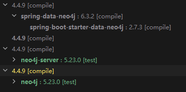

# 结合Spring Data Neo4j与Neo4j Java Driver在Spring Boot中处理复杂Neo4j查询

## Neo4j Java Driver和Spring Data Neo4j

1. **[Neo4j Java Driver](https://neo4j.com/docs/java-manual/current/install/)**: 是Neo4j官方提供的Java驱动程序，可以直接通过Cypher查询与Neo4j数据库交互，返回原始数据。
2. **[Spring Data Neo4j](https://docs.spring.io/spring-data/neo4j/reference/getting-started.html)**: 是Spring Data的一个模块，为Neo4j提供Spring Data支持，包括Repository支持、对象映射和简单的CRUD查询。

## 出现的问题

在程序中，仅使用Spring Data Neo4j只能处理基本操作，如创建节点、关系、删除节点和删除关系等。然而，随着程序的扩展，需要根据多个未知属性对查询节点进行过滤，并处理Cypher查询返回的复杂结果（如节点-关系-节点的集合）。Spring Data Neo4j在处理复杂查询和操作时不够友好，因此尝试在Spring Boot中引入Neo4j Java Driver，以处理更复杂的查询和操作。

### 检查依赖版本

在添加Neo4j Java Driver依赖之前，需要检查其与Spring Data Neo4j的兼容性。由于Spring Data Neo4j的版本会根据Spring Boot版本自动匹配，使用[Maven helper](https://plugins.jetbrains.com/plugin/7179-maven-helper)分析依赖关系，确保Neo4j Java Driver的版本与Spring Data Neo4j使用的版本一致。Spring Boot版本为2.7.3，对应的Neo4j Java Driver版本为4.4.9。


## 需求分析

### 过滤查询

每个节点除了UUID等基本信息外，还包含一些属性，可以作为过滤条件。在知识图谱中，节点可以具有多个属性（如节点名称、语言等），这些属性可以作为过滤条件。由于额外属性的键值和数量不固定，需要使用动态查询来处理，而在Spring Data Neo4j中，无法直接在`@Query`注解上拼接Cypher语句。

### 处理返回结果

在过滤查询后，需要返回一整张图，即一个包含节点和关系的集合。由于Spring Data Neo4j是对象映射工具，它无法直接返回原始数据，只能返回已定义的实体类，因此无法直接映射Cypher查询返回结果中的多种类型数据（如节点集合和关系集合）以及节点上的未知属性。

## 代码实现

### 导入neo4j-java-driver依赖

```xml
<dependency>
    <groupId>org.neo4j.driver</groupId>
    <artifactId>neo4j-java-driver</artifactId>
    <version>4.4.9</version>
</dependency>
```


### 准备 Cypher 语句
定义三个实体类型：`User`、`Graph` 和 `GraphNode`。一个 `User` 节点可以创建一个或多个 `Graph` 节点，通过 `RELATION` 类型的关系进行连接，该关系包含属性 `name = "Have"`。一个 `Graph` 节点可以包含多个 `GraphNode` 节点，同样通过 `RELATION` 类型的关系进行连接，该关系也包含属性 `name = "Have"`。`GraphNode` 节点之间存在关系，关系类型为 `RELATION`，关系属性为自定义的 `name`。
```cypher
MATCH (g:Graph { uuid: $uuid })
OPTIONAL MATCH (g)-[:RELATION]->(n:GraphNode)
OPTIONAL MATCH (n)-[r:RELATION]->(:GraphNode)
WITH DISTINCT n, COLLECT(r) AS relations
RETURN DISTINCT n, relations
SKIP $skip
LIMIT $limit
```

#### Cypher语句解释
1. **MATCH (g:Graph { uuid: $uuid })**:
- 解释: 匹配具有指定 `uuid` 的 `Graph` 节点。
- 作用: `$uuid` 是一个参数，表示要查找的 `Graph` 节点的唯一标识符。
2. **OPTIONAL MATCH (g)-[:RELATION]->(n:GraphNode)**:
- 解释: 匹配从 `Graph` 节点出发，通过 `RELATION` 关系连接到的 `GraphNode` 节点。
- 作用: `OPTIONAL MATCH` 确保即使没有找到匹配的 `GraphNode` 节点，查询也不会失败，而是返回空的结果。
3. **OPTIONAL MATCH (n)-[r:RELATION]->(:GraphNode)**:
- 解释: 匹配从 `GraphNode` 节点出发，通过 `RELATION` 关系连接到的其他 `GraphNode` 节点，并捕获这些关系。
- 作用: 同样使用 `OPTIONAL MATCH`，确保即使没有找到匹配的关系，查询也不会失败。
4. **WITH DISTINCT n, COLLECT(r) AS relations**:
- 解释: 使用 `WITH` 子句将匹配到的 `GraphNode` 节点和它们的关系进行去重，并将关系收集到一个列表中。
- 作用: `DISTINCT` 确保返回的 `GraphNode` 节点是唯一的，`COLLECT(r)` 将所有匹配的关系收集到一个名为 `relations` 的列表中。
5. **RETURN DISTINCT n, relations**:
- 解释: 返回去重后的 `GraphNode` 节点及其关系列表。
- 作用: `DISTINCT` 确保返回的 GraphNode 节点是唯一的。
6. **SKIP $skip**:
- 解释: 跳过指定数量的结果。
- 作用: `$skip` 是一个参数，表示要跳过的结果数量，常用于分页查询。
7. **LIMIT $limit**:
- 解释: 限制返回结果的数量。
- 作用: `$limit` 是一个参数，表示要返回的最大结果数量，常用于分页查询。

### 加入过滤条件
查询节点的过滤条件是动态的，需要根据传入的多个未知属性对查询的节点进行过滤。使用一个 `Map<String, String>` 来存储这些属性，并处理这个集合以拼接过滤条件。

```java
private static StringBuilder getFilterProperties(final String node, final Map<String, String> entries) {
    return new StringBuilder()
        .append("WHERE ")
        .append(
            entries.entrySet().stream()
                .map(filter -> String.format("%s.%s = '%s'", node, filter.getKey(),
                    escapeSingleQuotes(filter.getValue())))
                .collect(Collectors.joining(" AND "))
        );
}
```

通过这个方法，可以将传入的过滤条件拼接到Cypher语句中，从而实现动态过滤。

### 拼接Cypher语句
使用 `StringBuilder` 通过 `append()` 方法添加不同的部分，包括过滤条件、节点和关系等。`StringBuilder` 在多次拼接字符串时性能更好，它可以在内部缓冲区中逐步构建字符串，减少了内存分配和复制的开销。
```java
final StringBuilder cypherQuery = new StringBuilder("MATCH (g:Graph { uuid: $uuid })")
                .append(" OPTIONAL MATCH (g)-[:RELATION]->(n:GraphNode) ")
                .append(properties != null && !properties.isEmpty() ?
                        getFilterProperties("n", properties) : "")
                .append(" OPTIONAL MATCH (n)-[r:RELATION]->(:GraphNode) ")
                .append(" WITH DISTINCT n, COLLECT(r) AS relations")
                .append(" RETURN DISTINCT n, relations")
                .append(" SKIP $skip ")
                .append(" LIMIT $limit");
```

### 开启Session查询并处理返回结果
```java
try (Session session = driver.session(SessionConfig.builder().build())) {
    return session.readTransaction(tx -> {
        final var result = tx.run(cypherQuery.toString(), Values.parameters(
            Constants.UUID, uuid,
            "skip", skip,
            "limit", limit
        ));

        final List<RelationVO> relations = new ArrayList<>();
        final List<NodeVO> nodes = new ArrayList<>();
        long totalCount = 0;

        while (result.hasNext()) {
            final Record record = result.next();
            final NodeVO n = nodeExtractor.extractNode(record.get(Constants.NODE_ALIAS_N));
            nodes.add(n);
            totalCount++;

            relations.addAll(nodeExtractor.extractRelationships(record.get(Constants.RELATIONS)));
        }

        return new GetRelationDTO(relations, new ArrayList<>(nodes), totalCount);
    });
}
```

在开启查询时，创建一个 `Session` 对象。它是与数据库连接的会话，用于执行事务和查询。`SessionConfig.builder().build()` 用于配置会话，默认情况下使用默认配置。然后启动一个事务，在事务 `tx` 中执行 Cypher 查询。使用 `Record` 对象来获取查询结果。通过 `nodeExtractor` 将其转换为 `NodeVO` 对象。然后使用 `nodeExtractor.extractRelationships(record.get(Constants.RELATIONS))` 获取节点之间的关系，并将其转换为 `RelationVO` 对象，最后将这些对象添加到列表中。最后，返回一个包含所有节点和关系信息的 `GetRelationDTO` 对象。

#### 事务
这里需要注意的是，`Neo4j Java Driver` 不像 `Spring Data Neo4j` 那样由Spring提供了[@Transactional](https://docs.spring.io/spring-framework/reference/data-access/transaction/declarative/annotations.html)注解自动管理事务，而是需要我们手动开启事务。`Neo4j Java Driver`只有在Session域里的语句才会被事务管理，如果这是一个写的请求，我们需要把事务范围扩大到整个业务方法上，来保证操作的原子性，对于如何高效简洁地实现`Neo4j Java Driver`的事务管理，我在另一篇文章中有详细说明。

### Node和Relation提取方法
```java
public NodeVO extractNode(final Object node) {
    final NodeVO nodeInfo = new NodeVO();

    if (node instanceof NodeValue) {
        final NodeValue nodeValue = (NodeValue) node;
        final Map<String, Object> nodeMap = nodeValue.asNode().asMap();
        final Map<String, String> stringNodeMap = nodeMap.entrySet().stream()
            .collect(Collectors.toMap(Map.Entry::getKey, entry -> String.valueOf(entry.getValue())));

        setNodeInfo(stringNodeMap, nodeInfo);
    }
    return nodeInfo;
}

public List<RelationVO> extractRelationships(final Value relationshipsValue) {
    final List<RelationVO> relations = new ArrayList<>();

    if (relationshipsValue != null) {
        Optional.ofNullable(relationshipsValue.asList(Value::asRelationship))
                .ifPresent(relationships -> {
                    for (final Relationship relationshipValue : relationships) {
                        final Map<String, Object> relMap = relationshipValue.asMap();
                        final Map<String, String> stringRelMap = relMap.entrySet().stream()
                                .collect(Collectors.toMap(Map.Entry::getKey,
                                        entry -> String.valueOf(entry.getValue())));

                        final RelationVO relation = RelationVO.builder()
                                .name(stringRelMap.getOrDefault(Constants.NAME, ""))
                                .createTime(stringRelMap.getOrDefault(Constants.CREATE_TIME_WITHOUT_HUMP, ""))
                                .updateTime(stringRelMap.getOrDefault(Constants.UPDATE_TIME_WITHOUT_HUMP, ""))
                                .uuid(stringRelMap.getOrDefault(Constants.UUID, ""))
                                .sourceNode(stringRelMap.getOrDefault(Constants.SOURCE_NODE, ""))
                                .targetNode(stringRelMap.getOrDefault(Constants.TARGET_NODE, ""))
                                .build();

                        relations.add(relation);
                    }
                });
    }

    return relations;
}
```

到这里，我们就完成了过滤查询和解析图数据库的操作。
### 完整代码
```java
public GetRelationDTO getRelationByGraphUuid(final String uuid, final Map<String, String> properties,
                                                 final Integer pageNumber, final Integer pageSize) {
    final int skip = (pageNumber - 1) * pageSize;
    final int limit = pageSize;

    final StringBuilder cypherQuery = new StringBuilder("MATCH (g:Graph { uuid: $uuid })")
        .append(" OPTIONAL MATCH (g)-[:RELATION]->(n:GraphNode) ")
        .append(properties != null && !properties.isEmpty() ? getFilterProperties(Constants.NODE_ALIAS_N, properties) : "")
        .append(" OPTIONAL MATCH (n)-[r:RELATION]->(:GraphNode) ")
        .append(" WITH DISTINCT n, COLLECT(r) AS relations")
        .append(" RETURN DISTINCT n, relations")
        .append(" SKIP $skip ")
        .append(" LIMIT $limit");

    try (Session session = driver.session(SessionConfig.builder().build())) {
        return session.readTransaction(tx -> {
            final var result = tx.run(cypherQuery.toString(), Values.parameters(
                Constants.UUID, uuid,
                    "skip", skip,
                    "limit", limit
            ));

            final List<RelationVO> relations = new ArrayList<>();
            final List<NodeVO> nodes = new ArrayList<>();
            long totalCount = 0;

            while (result.hasNext()) {
                final Record record = result.next();
                final NodeVO n = nodeExtractor.extractNode(record.get(Constants.NODE_ALIAS_N));
                nodes.add(n);
                totalCount++;

                relations.addAll(nodeExtractor.extractRelationships(record.get(Constants.RELATIONS)));
            }

                return new GetRelationDTO(relations, new ArrayList<>(nodes), totalCount);
        });
    }
}
```

GetRelationDTO类：
```java
public class GetRelationDTO {
    private List<RelationVO> relations;
    private List<NodeVO> nodes;
    private Long totalCount;
}
```

RelationVO类：
```java
public class RelationVO {
    private String uuid;
    private String name;
    private String createTime;
    private String updateTime;
    private String sourceNode;
    private String targetNode;
}
```

NodeVO类：
```java
public class NodeVO {
    private String uuid;
    private Map<String, String> properties;
    private String createTime;
    private String updateTime;
}
```

### 项目地址

这是一个用于构建知识图谱的Web服务，基于Neo4j数据库，结合了Neo4j Java Driver和Spring Data Neo4j的强大功能。

项目仓库地址：[https://github.com/paion-data/aristotle](https://github.com/paion-data/aristotle)
